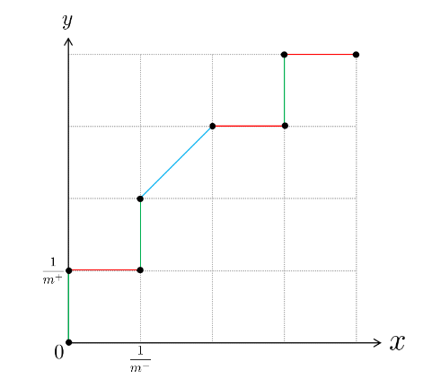

# chapter02

## 为什么需要有验证集？

在看到西瓜书 P28 关于验证集 (validation set)的时候，产生疑惑了：为什么需要用验证集评估模型的泛化能力因此来进行模型选择和调参，直接用 Test set 不就行了吗？

在看完下面的之后

1. [知乎 - 能不能只要训练集和测试集，不要验证集呢?](https://www.zhihu.com/question/265443164/answer/2417856431)
2. 南瓜书 P10
3. gpt 

整理的笔记如下：

### 概念与作用

- 训练集（Training Set）：**参与训练**，模型从训练集中学习经验，从而不断减小训练误差
- 验证集（Validation Set）：**不参与训练**，通常用于(1) 调节超参数，(2) 选择模型架构，(3) 评估模型在训练过程中是否过拟合：一般来说验证集表现稳定后，若继续训练，训练集表现还会继续上升，但是验证集会出现不升反降的情况，这样一般就发生了过拟合。所以验证集也用来判断何时停止训练。验证集的性能评估结果用于指导模型的调整
- 测试集（Test Set）：**不参与训练**，用于在模型训练完成后，评估模型的最终性能

在之前模型使用【验证集】确定了【超参数】，使用【训练集】调整了【可训练参数】，最后使用一个从没有见过的数据集来判断这个模型的好坏

### 为什么不能用测试集调参？

1. 防止数据泄露
    - 使用测试集进行调参会导致模型在训练过程中间接看到测试集数据 (未知变成已知) ，这会引起数据泄露
    - 数据泄露会导致模型对测试集过拟合，使得模型在测试集上表现出过于理想的性能，但在实际应用中（对新数据）的泛化能力会下降
2. 评估公正性
    - 测试集的目的是评估模型在未见过的数据上的表现。如果测试集被用于调参，测试集的结果将不再是独立的验证，评估结果会偏向乐观，不能真实反映模型在真实数据上的性能
3. 避免过拟合
   - 使用测试集调参会导致模型调整以优化测试集上的表现，可能造成对测试集的过拟合
   - 正确的做法是使用验证集来调参，以确保模型在训练数据之外有良好的表现，而测试集仅用于最终的性能评估

## ROC Curve 是如何绘制的，其中如何体现出 TPR 与 FPR 的？

> 主要参考《南瓜书》P14 ~ 15

假设我们已经训练得到一个学习器 $f(s)$ ，现在用该学习器来对我们的 8 个测试样本（4 个正例，4 个反例，即 $m^+ = m^- = 4$ 进行预测，假设预测结果为：

$$(s_1,0.77,+),(s_2,0.62,-),(s_3,0.58,+),(s_4,0.47,+),\\
(s_5,0.47,-),(s_6,0.33,-),(s_7,0.23,+),(s_8,0.15,-).$$

其中 $+$ 和 $-$ 分别表示样本实际为正例和反例；数字表示学习器 $f$ 预测该样本为正例的概率

接下来进行详细推导：

1. 把所有预测样本按照学习器给出的预测结果进行排序 (上面的预测结果已经是排序之后的结果)
2. 将 threshold 设置为一个不可能取到的最大值，比如设置为 1。此时 TP = 0，因此 TPR 与 FPR 都为 0，在坐标 (0, 0) 处标记一个点
3. 自上到下改变阈值：首先将分类阈值设定为 0.77，即预测最大有可能是正例样本的预测正例概率，此时 TP = 1，**后面的 7 个样本都被预测为反例**，因此 TP = 1, TN = 4, FN = 3, FP = 0, 故 $$TPR = \frac{TP}{TP+FN} = \frac{1}{1+3} = \frac{1}{4}$$ $$FPR = \frac{FP}{TN+FP} = \frac{0}{4+0} = 0$$ 体现在 ROC Curve 上，就是纵坐标 TPR 增加 $\frac{1}{m^+} = \frac{1}{4}$, 横坐标不变
4. 递归 3 中的步骤，直到 $s_8$ 的 0.15 为止

## 排序损失 $\ell_{\mathrm{rank}}$ 为什么是 ROC 曲线之上的面积

参考

1. [CSDN - 排序损失的定义](https://blog.csdn.net/weixin_52703681/article/details/122960681)
2. 《南瓜书》P16 ~ 18

为什么是 ROC 曲线之上的面积可以参考 CSDN 这篇文章，图画的很棒；公式的具体解析参考《南瓜书》严谨的数学证明

