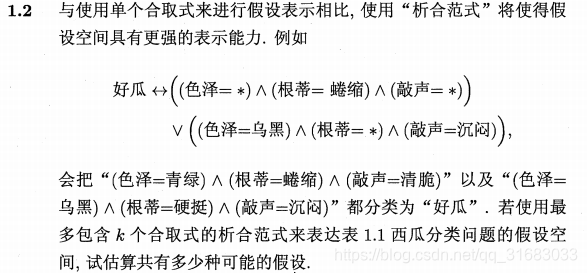
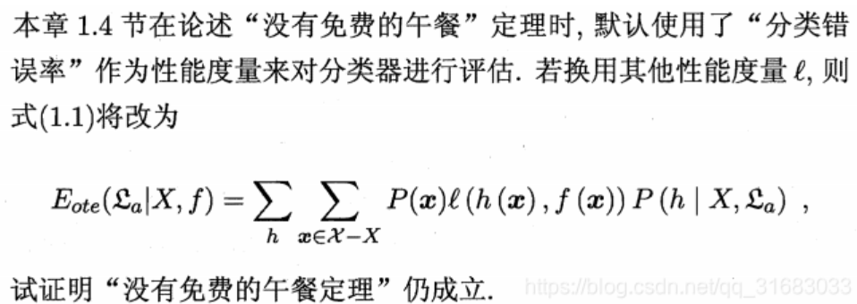

# ex01

表 1 中若只包含编号为 1 和 4 的两个样例，试给出相应的版本空间

## Step 1: Describe samples

sample1 = (色泽=青绿；根蒂=蜷缩；敲声=浊响) -> 好瓜
sample2 = (色泽=乌黑；根蒂=稍蜷；敲声=沉闷) -> 坏瓜

易知假设空间规模大小为 3 * 3 * 3 + 1 = 28

## Step 2: Construct Hypothesis Space

```
1. (色泽=*；根蒂=*；敲声=*)
2. (色泽=青绿；根蒂=*；敲声=*)
3. (色泽=乌黑；根蒂=*；敲声=*)
4. (色泽=*；根蒂=蜷缩；敲声=*)
5. (色泽=*；根蒂=稍蜷；敲声=*)
6. (色泽=*；根蒂=*；敲声=浊响)
7. (色泽=*；根蒂=*；敲声=沉闷)
8. (色泽=*；根蒂=蜷缩；敲声=浊响)
9. (色泽=*；根蒂=蜷缩；敲声=沉闷)
10. (色泽=*；根蒂=稍蜷；敲声=浊响)
11. (色泽=*；根蒂=稍蜷；敲声=沉闷)
12. (色泽=青绿；根蒂=*；敲声=浊响)
13. (色泽=青绿；根蒂=*；敲声=沉闷)
14. (色泽=乌黑；根蒂=*；敲声=浊响)
15. (色泽=乌黑；根蒂=*；敲声=沉闷)
16. (色泽=青绿；根蒂=蜷缩；敲声=*)
17. (色泽=青绿；根蒂=稍蜷；敲声=*)
18. (色泽=乌黑；根蒂=蜷缩；敲声=*)
19. (色泽=乌黑；根蒂=稍蜷；敲声=*)
20. (色泽=青绿；根蒂=蜷缩；敲声=沉闷)
21. (色泽=青绿；根蒂=蜷缩；敲声=浊响)
22. (色泽=青绿；根蒂=稍蜷；敲声=沉闷)
23. (色泽=青绿；根蒂=稍蜷；敲声=浊响)
24. (色泽=乌黑；根蒂=蜷缩；敲声=沉闷)
25. (色泽=乌黑；根蒂=蜷缩；敲声=浊响)
26. (色泽=乌黑；根蒂=稍蜷；敲声=沉闷)
27. (色泽=乌黑；根蒂=稍蜷；敲声=浊响)
28. (色泽=∅；根蒂=∅；敲声=∅)
```

## Step 3: Delete samples

删除与正例不一致的假设: (色泽=青绿；根蒂=蜷缩；敲声=浊响)
删除与反例一致的假设: (色泽=乌黑；根蒂=稍蜷；敲声=沉闷)

最终结果

```
2. (色泽=青绿；根蒂=*；敲声=*)
4. (色泽=*；根蒂=蜷缩；敲声=*)
6. (色泽=*；根蒂=*；敲声=浊响)
8. (色泽=*；根蒂=蜷缩；敲声=浊响)
12. (色泽=青绿；根蒂=*；敲声=浊响)
16. (色泽=青绿；根蒂=蜷缩；敲声=*)
21. (色泽=青绿；根蒂=蜷缩；敲声=浊响)
```

# ex02



# ex03

若数据包含噪声，则假设空间中有可能不存在与所有训练样本都一致的假设。在此情形下，设计一种归纳偏好用于假设选择

# ex04



# ex05

试述机器学习能在互联网搜索的哪些环节起什么作用

## Answer

1. 文本处理：利用自然语言处理(NLP, Natural Language Processing) 技术对网页内容进行分词、词性标注和语义分析，构建高效的倒排索引

2. 意图识别：通过深度学习 (Deep Learning) 模型理解用户查询的意图，提升搜索引擎对自然语言查询的理解能力

3. A/B TEST：利用机器学习进行A/B测试，评估不同算法和模型对搜索性能的影响
